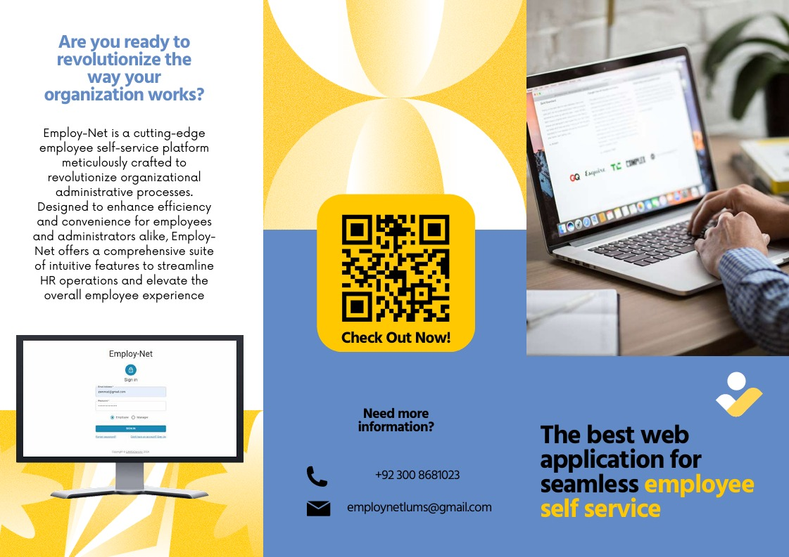
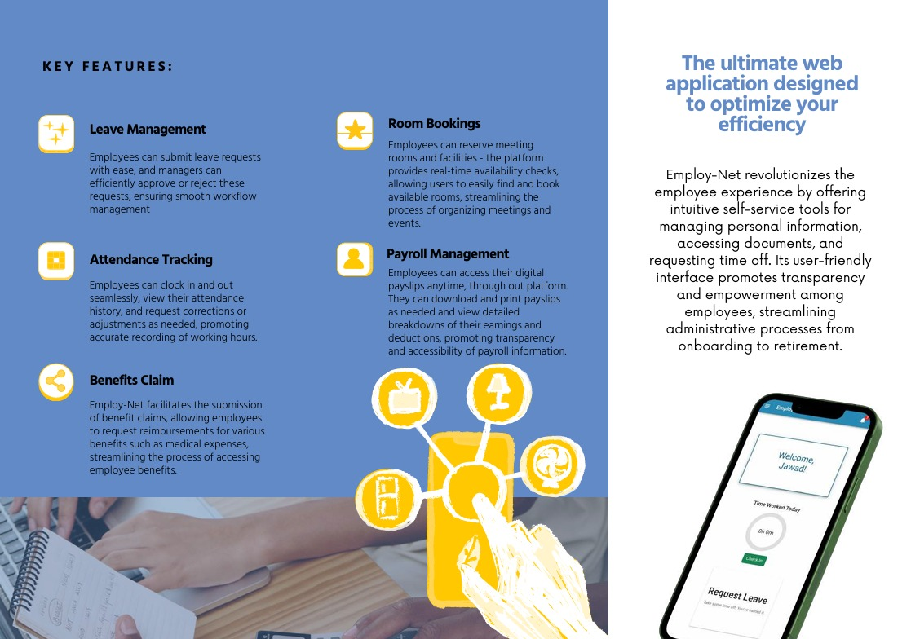
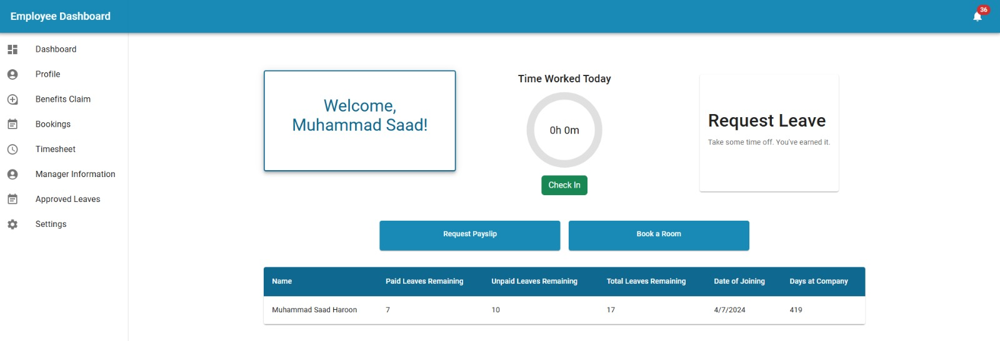
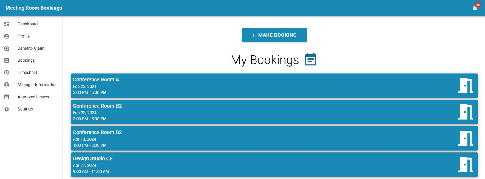

# 📌 EmployNet

> A full-featured employee self-service HR platform built with the **MERN** stack, enabling seamless management of attendance, leave, user accounts, and automated confirmations — all in one place.

---

<p align="center">
  
  
</p>

---

## 🌐 Live Demo
**🔗 [https://employnet.onrender.com](https://employnet.onrender.com)**

---

## 🚀 Features

### Login

The login page provides a simple and secure interface for existing users to access their accounts. Users must enter their `Username` and `Password` and select their role as either an `Employee` or a `Manager`. Upon providing the correct credentials, they will be granted access to their respective dashboards where they can manage their tasks and view important information.

## Employee Homepage

Once an employee logs into Employ-Net, they are greeted with the Employee Homepage. This page serves as the central hub for employee interactions and provides the following features:

- **Welcome Message**: A personalized greeting that welcomes the employee to Employ-Net, reinforcing the user-friendly nature of the platform.
- **Role Confirmation**: A confirmation message stating that the user is logged in as an employee, which helps to ensure that they have accessed the correct account type.
- **Update Information**: An actionable button that allows employees to update their personal or professional information. Keeping profiles up-to-date ensures the accuracy of the system's data.
- **Check-In/Check-Out Confirmation**: A status message accompanied by a button that reflects the employee's current check-in status. This feature is designed to provide a simple way for employees to clock in and out of their shifts and to confirm their current status at a glance.

The Employee Homepage is designed to be intuitive and efficient, enabling employees to focus on their tasks without unnecessary complexity. Please note that the functionalities available on the Employee Homepage may vary depending on the employee's role and permissions within the company.

## Employee Dashboard

The Employee Dashboard is a personalized and informative interface within Employ-Net that presents key statistics and details relevant to an individual's employment. Here's what employees can expect to find on their dashboard:

- **Personalized Welcome**: Each employee is greeted by name, adding a personal touch and confirming that the logged-in session is customized to their profile.
- **Statistics Section**: This area displays crucial data regarding the employee's leave balances:
  - **Number of Paid Leaves Remaining**: Shows the count of remaining paid leaves the employee can take.
  - **Number of Unpaid Leaves Remaining**: Indicates how many unpaid leaves the employee has at their disposal.
  - **Overall Leaves Remaining**: Provides a total count of both paid and unpaid leaves combined, giving a quick overview of available time off.
- **Date of Joining**: Displays the date the employee started with the company, helping them keep track of their tenure.
- **Days at Company**: A dynamic counter showing the number of days the employee has been part of the company, updated daily.

The dashboard is designed to give employees a quick snapshot of their leave status and employment duration, enabling them to plan ahead and manage their time off effectively. It is a key feature for maintaining transparency and ensuring that employees have easy access to their most up-to-date employment information.

## Attendance Tracking

Employ-Net incorporates a robust Attendance Tracking feature that enables employees to manage and monitor their work attendance with ease. Here's how it functions:

- **Check-In/Check-Out**: Employees have the ability to check in when they start their workday and check out at the end. This feature captures the exact time of these actions to ensure accurate attendance records.
- **Attendance Evaluation**: The system automatically evaluates the total hours worked in a day. If an employee works for 8 hours or more, they are marked as 'Present' for the day. Any duration less than 8 hours will be recorded as 'Absent' in the database, taking into account the company's attendance policy.
- **Monthly Attendance View**: Employees can access their attendance records for the current month at any time. This feature provides them with a transparent view of their attendance status, including the number of days present, absent, and any patterns in their check-in and check-out times.

This attendance tracking mechanism is designed to foster a disciplined work environment and to support employees in maintaining consistent work habits. It also assists the HR department in managing leave balances and attendance records more efficiently.

## Leave Management

Employ-Net's Leave Management feature streamlines the process of requesting and managing leave for employees. It offers automated handling of paid leave requests and manager approval-based handling of unpaid leaves. Here's how it works:

- **Paid Leave Requests** -
Employees can submit requests for paid leave directly through the Employ-Net platform. The process is straightforward:

Submission: Employees navigate to the Leave Management section and submit a request for paid leave, specifying the dates and reason for their absence.

Automated Acceptance: Paid leave requests are automatically processed and accepted by the system, provided they meet the company's policies and available leave balances.

Confirmation: Once approved, employees receive confirmation of their paid leave request via email and notification within the Employ-Net interface.

- **Unpaid Leave Requests** -
For unpaid leave requests, a manager approval process is implemented to ensure appropriate oversight. Here's how it works:

Submission: Employees submit requests for unpaid leave through the platform, providing details such as the duration and reason for their absence.

Manager Approval: Unpaid leave requests are routed to the respective manager for approval. The manager reviews the request and decides whether to approve or deny it based on factors such as workload and staffing requirements.

---

## 💼 Tech Stack

### Core Technologies
<p align="center">
  
</p>

### Tools & Libraries
<p align="center">
  
</p>

---

## 📂 Directory Structure

```
EmployNet/
├── UI-Design/
│   ├── brochure_page1.jpeg
│   ├── brochure_page2.jpeg
│   ├── Room_Bookings.jpeg
│   └── employee_dashboard.jpeg
│
├── employ-net/         # Main frontend app (React)
│   ├── public/
│   ├── src/
│   │   ├── components/
│   │   ├── pages/
│   │   ├── App.js
│   │   └── index.js
│   └── package.json
│
├── .vercel/            # Deployment configs
├── README.md
├── LICENSE
└── EmployNet_Brochure.pdf
```

---

## 🧭 Setup & Installation

### Step 1: Install Dependencies
```bash
npm i
```
- This command installs all the dependencies required for the application to run. Dependencies are defined in the package.json file and may include libraries, frameworks, and other modules needed for the application.

### Step 2: Start React App
```bash
npm start
```
- After installing the dependencies, you can start the application using this command. It initiates the React application and serves it usually on port 3000.
- Runs the app at: [http://localhost:3000](http://localhost:3000)

> 🔁 The app reloads on changes. Watch the console for lint errors.

---

## 📸 UI Pages

### 📈 Employee Dashboard
<p align="center">
  
</p>

### 🆕 Room_Bookings Page
<p align="center">
  
</p>

## 🔖 License
This project is licensed under the [Apache 2.0 License](./LICENSE).

---

## 🙌 Contributions
Feel free to fork this repo and contribute. Raise an issue or PR — contributions are welcome!
---

## 📫 Contact
For support, reach out via [GitHub Issues](https://github.com/SaadH-077/EmployNet/issues)

---

> © 2024 Muhammad Saad Haroon. All rights reserved.
